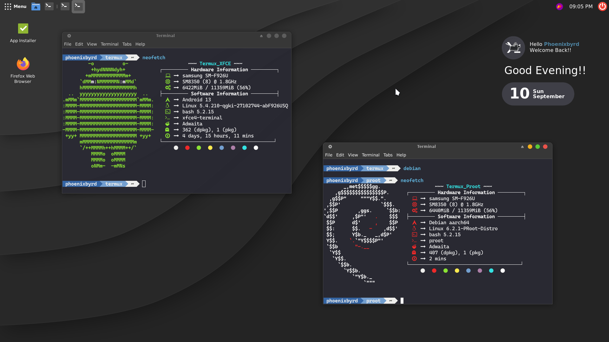

# Termux_XFCE

Configura un escritorio XFCE en Termux y una instalación de Debian proot. Esta configuración utiliza Termux-X11, se instalará el servidor termux-x11 y se te pedirá que permitas a Termux instalar el APK de Android.

Solo necesitas elegir tu nombre de usuario y seguir las instrucciones. Esto ocupará aproximadamente 4GB de espacio de almacenamiento. Ten en cuenta que este proceso puede llevar tiempo. A medida que instales aplicaciones, consumirán más espacio de almacenamiento.

Por favor, lee todo el README para obtener más información sobre esta configuración.


# Instalación

Para instalar, ejecuta este comando en Termux:

```
curl -sL https://raw.githubusercontent.com/nuntius-dev/Termux-XFCE/refs/heads/main/install.sh -o install.sh && chmod +x install.sh && ./install.sh
```
&nbsp;


Únete al Discord para cualquier pregunta, ayuda, sugerencias, etc. [https://discord.gg/pNMVrZu5dm](https://discord.gg/pNMVrZu5dm)  


&nbsp;


  
  
# Caso de uso
  
Así es como uso personalmente Termux en mi Galaxy Fold 3. Este script fue creado principalmente para uso personal, pero también para otros que deseen probar mi configuración. Es mi herramienta diaria junto con un monitor portátil Lepow de 15 pulgadas, un teclado y un ratón Bluetooth. Está pensado para ser utilizado como un reemplazo de PC/portátil, conectado a un monitor, teclado y ratón, y usado como lo harías con cualquier PC/portátil. Lo ejecuto en mi Samsung Galaxy Fold 3.

  

&nbsp;

# Iniciando el escritorio

Durante la instalación, recibirás un mensaje emergente para permitir instalaciones desde Termux. Esto abrirá el APK para la aplicación Termux-X11 en Android. Aunque no es obligatorio permitir instalaciones desde Termux, deberás instalar manualmente usando un explorador de archivos y encontrar el APK en tu carpeta de descargas.
  
Usa el comando ```start``` para iniciar una sesión de Termux-X11.
  
Esto iniciará el servidor termux-x11, el escritorio XFCE4 y abrirá la aplicación Termux-X11 directamente en el escritorio.

Para ingresar a la instalación Debian proot desde el terminal, usa el comando ```debian```.

Además, no necesitas configurar el display en Debian proot, ya que ya está configurado. Esto significa que puedes usar el terminal para iniciar cualquier aplicación GUI y esta se ejecutará.

&nbsp;

# Aceleración de hardware y Proot

Aquí tienes algunos alias preparados para facilitar el inicio de aplicaciones.

Termux XFCE:

- ```zrun```: Inicia aplicaciones en Debian proot con aceleración de hardware.
- ```zrunhud```: Igual que el anterior, pero con un HUD de FPS.
- ```hud```: Muestra el HUD de FPS para juegos en Termux.

Debian proot:

- ```zink```: Inicia aplicaciones con aceleración de hardware.
- ```hud```: Muestra el HUD de FPS.

Para ingresar a proot, usa el comando ```debian```. Desde ahí puedes instalar software adicional con `apt` y usar `cp2menu` en Termux para copiar los elementos del menú a XFCE.

Nala se ha elegido como interfaz en Debian proot. Tal como está configurado, no necesitas usar `sudo` antes de ejecutar comandos `apt`. Esto te permite ejecutar `apt update`, `apt upgrade`, etc., sin necesidad de `sudo`. Esta configuración es similar en Termux y funciona de la misma manera.

&nbsp;

Hay dos scripts disponibles para esta configuración:
  
- ```prun```: Ejecuta este comando seguido de un comando que deseas ejecutar desde Debian proot para ejecutarlo desde el terminal de Termux sin ingresar a proot directamente con ```debian```.
- ```cp2menu```: Ejecuta este comando para copiar archivos `.desktop` de Debian proot al menú "Inicio" de Termux XFCE, evitando tener que iniciarlos desde el terminal. Un lanzador está disponible en la sección del menú del sistema.


&nbsp;

# Proceso completado (señal 9) - presiona Enter

Instala LADB desde Play Store o desde aquí: https://github.com/hyperio546/ladb-builds/releases.

Conéctate a WiFi.  

En pantalla dividida, abre LADB en un lado y los ajustes de desarrollador en el otro.

En los ajustes de desarrollador, activa la depuración inalámbrica. Luego, accede para obtener el número de puerto y haz clic en "Emparejar dispositivo" para obtener el código de emparejamiento.

Ingresa ambos valores en LADB.

Una vez que se conecte, ejecuta este comando:
  
```adb shell "/system/bin/device_config put activity_manager max_phantom_processes 2147483647"```

También puedes ejecutar `adb shell` directamente desde Termux siguiendo la guía de este video:

[https://www.youtube.com/watch?v=BHc7uvX34bM](https://www.youtube.com/watch?v=BHc7uvX34bM)
